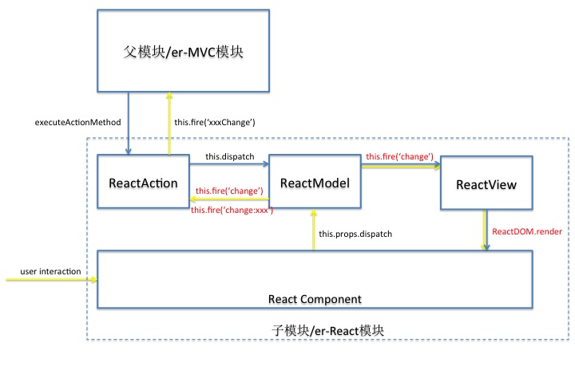

# 凤巢FE React业务模块开发规范（草案）

## 适用范围
凤巢业务团队前端项目

## 编撰
Wang Yi (wangyi25@baidu.com)

## 修订
* 2016-03-22 v0.0.1 初始版本

## 基础约定
### 要求
在本文档中，使用的关键字会以中文+括号包含的关键字英文表示，譬如：**必须(MUST)**，关键字被定义在rfc2119中。
* **MUST**：表示绝对要求这样做。**REQUIRED**或者**SHALL**，与之同义。
* **MUST NOT**：表示绝对不要求这样做。**SHALL NOT**与之同义。
* **SHOULD**：表示一般情况下应该这样做，但是在某些特定情况下可以忽视这个要求。**RECOMMENDED**与之同义。
* **SHOULD NOT**：表示一般情况下不应该这样做，但是在某些特定情况下可以忽视这个要求。**NOT  RECOMMENDED**与之同义。
* **MAY**：表示这个要求完全是可选的，你可以这样做，也可以不这样做。**OPTIONAL**与之同义。

### 依赖
* `er`：v3.x [GitHub](https://github.com/ecomfe/er)
* `ReactJS`：v0.14.7 [GitHub](https://github.com/facebook/react)
* `fc-view`：v0.0.1 [GitHub](https://github.com/fcfe/fc-view)

### 名词解释
* 模块`（module）`：指的是业务开发中为了实现某一（组）功能而编写的业务代码集合。
* `er-MVC`模块：基于`er-MVC`框架开发的业务功能模块。
* `er-React`模块：基于`React`和`fc-view/ReactAction`、`fc-view/ReactModel`、`fc-view/ReactView`开发的业务功能模块。
* 自定义组件：基于`React`开发的用户界面组件。

## 模块命名
### 模块目录命名
```js
moduleNameLikeThis
```
* 模块的命名***必须(MUST)***使用`camel`命名规则。
* 模块的命名***建议(SHOULD)***用一个或两个单词组成的名词或动名词性质的词或词组。

### 模块内文件组织及命名
* `Action.js` 模块内***必须(MUST)***包含`Action.js`
* `Model.js` 模块内***必须(MUST)***包含`Model.js`
* `*.jsx.js` 模块内***必须(MUST)***至少包含一个`jsx`文件，为模块提供用户界面和交互逻辑的具体实现
* `View.js` 模块内***建议(SHOULD)***包含`View.js`
* `style.less` 模块内***可以(MAY)***包含`style.less`，为模块提供收敛级别的样式
* `service.js` 模块内***可以(MAY)***包含`service.js`，为模块内的`ajax`数据访问提供接口， 也可以引用其他模块的`service.js`进行数据处理
* `config.js` 模块内***可以(MAY)***包含`config.js`，为模块提供模块级别的配置， 也可以引用其他模块的`config.js`

## 通信
模块间通信和数据流向示意图如下：


## 开发规范
### Action.js
#### 构造
* `Action`***必须(MUST)***返回一个`fc-view.ReactAction`的派生类对象

```js
var fc = require('fc-core');
var ReactAction = require('fc-view/mvc/ReactAction');
var Model = require('./Model');
var View = require('./View');

var overrides = {
    modelType: Model,
    viewType: View
};

return fc.oo.derive(ReactAction, overrides);
```

#### 数据与行为
* `Action`***只能(MUST)***调用`dispatch`方法向`Model`派发数据
* `Action`***不允许(MUST NOT)***与`View`直接交互
* ***不建议(SHOULD NOT)***通过`Action`fire事件的方式将数据传递给外层的父模块，但当外层父模块为`er-MVC`模块时，***可选择(MAY)***使用此种方式来传递数据

### Model.js
#### 构造
* `Model`***必须(MUST)***返回一个`fc-view.ReactModel`的派生类对象

```js
var fc = require('fc-core');
var ReactModel = require('fc-view/mvc/ReactModel');

var overrides = {};

return fc.oo.derive(ReactModel, overrides);
```

#### 数据与行为
* ***尽量(SHOULD)***在`datasource`中完成数据初始化
* 在数据初始化完毕之后，***可以(MAY)***通过`prepare`方法对原始数据进行处理，生成自定义组件初始的`props`
* ***只能(MUST)***通过`set`和`fill`方法来更新数据，对于需要同时设置两个及以上的数据时，***建议(SHOULD)***使用`fill`来进行数据的批量操作
* 针对派发`（dispatch）`给Model的每一个动作`（action）`，都***需要(SHOULD)***声明一个对应的方法来更新Model中的数据
* 派发的动作名称***必须(MUST)***采用“动词 +（空格）+ 名词”的规则来命名，其中动词***必须(MUST)***为`create`、`get`、`update`、`delete`中的一个，名词***必须(MUST)***为能够对应到Model中概念的词语，譬如：

```js
// Action.js
MyAction.prototype.setListData = function (listData) {
    this.dispatch('update list', listData);
};

// Model.js
MyModel.prototype['update list'] = function (list) {
    this.set('listData', list);
};
```
* ***不建议(SHOULD NOT)***通过`Model`fire`change`事件的方式将数据变化告知`Action`，但当外层父模块为`er-MVC`模块，且子模块需要将数据变化通知到父模块时，***可选择(MAY)***在`Action`中侦听`Model`的`change`事件来将数据变化传递给外层模块，譬如：

```js
// Action.js
MyAction.prototype.initBehavior = function () {
    this.model.on('change', this.modelChangeHandler, this);
    this.model.on('change:listData', this.listDataChangeHandler, this);
};

MyAction.prototype.modelChangeHandler = function (event) {
    this.fire('modelchange', event.data);
};

MyAction.prototype.listDataChangeHandler = function (event) {
    this.fire('listdatachange', event.data);
};

// Model.js
MyModel.prototype['update list'] = function (list) {
    this.set('listData', list);
};
```

### *.jsx.js
#### 文件命名
* 模块中所有的jsx文件命名***必须(MUST)***使用`pascal`命名规则
* 模块视图根节点component对应的jsx文件名***建议(SHOULD)***与模块名称保持一致

#### 数据与行为
* `模型-->视图` 从模型数据更新到视图变化的过程由React框架自动完成，无需人为干预
* `视图-->模型` 视图根节点component初始的`props`包含`Model`中所有的数据对象，并含有一个`dispatch`闭包方法。从视图交互到模型的数据更新，主要通过在交互事件的handler中调用`this.props.dispatch`方法，将动作派发到`Model`中，更新对应的数据，从而导致视图的其他部分完成相应的状态变化，譬如：

```js
// Model.js
MyModel.prototype['update output'] = function (output) {
    this.set('output', output);
};

// MyComponent.jsx.js
var MyComponent = React.createClass({
    handleInputChange: function (e) {
        var text = e.target.value;
        this.props.dispatch('update output', text);
    },

    render: function () {
        return (
            <div>
                <input onChange={this.handleInputChange} />
                <span>{this.props.output}</span>
            </div>
        );
    }
});
```

#### Ajax请求
* 与React组件渲染数据相关的Ajax请求可以分为两类：
    1. 在组件初始渲染时就需要的数据，这部分数据请求***应当(SHOULD)***放在`Model`的`datasource`中
    2. 用户交互触发的数据请求，这部分请求***应当(SHOULD)***放在`Model`响应组件派发动作的方法中，譬如：

```js
//Model.js
MyModel.prototype['refresh list'] = function () {
    var me = this;
    service.getList().then(function (res) {
        me.set('listData', res.data.listData);
    });
};

// MyComponent.jsx.js
var MyComponent = React.createClass({
    handleRefreshBtnClick: function (e) {
        this.props.dispatch('refresh list');
    },

    render: function () {
        return (
            <div>
                <Table datasource={this.props.listData} />
                <button onClick={this.handleRefreshBtnClick}>刷新列表</button>
            </div>
        );
    }
});
```

#### UI控件
* 建议在React组件中使用FCUI2控件
* FCUI2控件的id和class命名规则与现在保持一致

#### 其他
* 其他关于jsx文件的编码规范请参考[凤巢FE React UI组件开发规范](http://gitlab.baidu.com/fc-fe/fcui2/blob/fcui2.0.1/docs/style-guide.md)


### View.js
#### 构造
* `View`***必须(MUST)***返回一个`fc-view.ReactView`的派生类对象
* `View`的app应当设置为根节点component

```js
var fc = require('fc-core');
var ReactView = require('fc-view/mvc/ReactView');
var MyComponent = require('./MyComponent.jsx');

var overrides = {
    app: MyComponent
};

return fc.oo.derive(ReactView, overrides);
```

#### 数据与行为
* 视图渲染与交互逻辑已经在React Component中实现，因此***不需要(SHOULD NOT)***在`View`中添加额外的渲染和交互逻辑，譬如DOM操作和DOM事件绑定等

## 其他
* 以弹窗为容器的业务模块，***应当(SHOULD)***通过BasicView弹出
* 埋点实现***应当(SHOULD)***在Model响应dispatch之后，通过dump此时的Model实现大部分埋点携带业务数据的需求

## 参考
* [React 官方 GitHub Page](https://facebook.github.io/react/index.html)
* [凤巢业务模块开发规范](http://fe.baidu.com/doc/ecom/fengchao/standard/module.text)
* [凤巢FE React UI组件开发规范](http://gitlab.baidu.com/fc-fe/fcui2/blob/fcui2.0.1/docs/style-guide.md)
* [React style guide](https://github.com/Khan/style-guides/blob/master/style/react.md)
